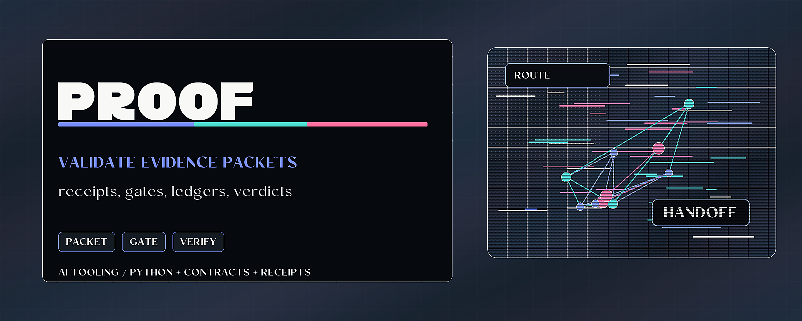

# Proof Surface

<p align="center">
  
</p>

> Validate evidence packets, receipt contracts, gates, ledgers, verdicts, and a family of domain proof-packet wedges.

## Try it

```bash
python -m pip install -e .
python -m pytest -q
```

## Why it matters

AI workflow records are only useful if another tool can validate their shape. Proof Surface defines small stdlib-only contracts for evidence packets, work receipts, gates, ledgers, delegation chains, and witness receipts so review tools can reject malformed or authority-shaped records.

On top of that base sits a family of nine **domain proof-packet wedges**: each takes evidence a tool already produces (an agent trace, a color measurement, a benchmark attempt, a solver run, a scientific claim) and turns it into a validated, re-derivable packet that carries a `MATCH` / `DRIFT` / `UNVERIFIABLE` verdict and refuses to overclaim. Every wedge enforces a domain-specific honesty gate, and all nine reach a buyer through one seam: `telos-proof <domain>`.

## What to test first

- Run the test suite and inspect which contract each validator covers.
- Create a packet with an unexpected field and confirm the validator rejects it.
- Remove required evidence from a receipt and confirm the result becomes invalid or unverifiable.

## Current status

- **Runtime:** Python 3.11+; stdlib-only core.
- **Surface:** Python API and contract-validator library for evidence packets, receipts, gates, ledgers, delegation chains, and witness receipts, plus nine domain proof-packet wedges and incumbent trace/eval adapters, all routed through the `telos-proof` CLI.
- **Verification:** the pytest suite is the conformance surface for the current contracts.
- **Boundary:** Proof Surface validates records. It does not grant authority, execute actions, or store private payloads.

## Technical framing

> The stdlib-only accountability contract: evidence packets, work-record receipts, and witness validators that reject authority-shaped content.

[](LICENSE)


[](https://github.com/HarperZ9/proof-surface/actions/workflows/ci.yml)

[](https://harperz9.github.io)

## Contracts

| Contract | Validator | What it is |
| --- | --- | --- |
| **proof-surface packet** (`v0.1`) | `validate_packet` | A neutral evidence/index packet that producers emit and a proof-index consumes. |
| **work-record receipt** (`v0.1`) | `validate_work_record` | A verifiable record of agent work that flows **outward** for review: the structural inverse of an authorization-suppression "prefire". |
| **authorization receipt** (`v0.1`) | `validate_authorization_receipt`, `check_action` | A verifiable record of a real, explicit, least-privilege, **expiring**, revocable grant of authority from a human principal to an agent. The **inward** complement to the work-record receipt, completing bilateral provenance. Verifier input only -- never re-injected as model context. |
| **witness receipt** | `validate_witness_receipt` | Consumer-side validator that **mirrors** EMET's published witness-receipt shape and closed verdict lattice. |
| **pre-execution gate** (`v0.1`) | `evaluate_gate`, `validate_gate_request` | A default-deny, fail-closed, **advisory** mediation layer. Given a planned action, its authorization receipt, a budget, and optional observed state, it returns a `GateDecision` (allow / deny / needs-human) with per-dimension check results. Reports a decision for the runtime/operator to enforce; **never grants authority** and is **never injected into a model as trusted state**. The inverse of the prefire's "consume embedded authority" -- the gate withholds approval unless every check positively passes. |
| **evaluation contract** (`v0.1`) | `validate_evaluation_contract`, `evaluate` | Evaluation as a deploy gate, not a vanity score: declares objective + criteria with thresholds and a `required` flag, and `evaluate` returns a **deploy / block / needs-human** decision. Uncertainty-aware -- if `measured ± uncertainty` straddles a threshold it escalates to needs-human; a required criterion with no result is `missing` -> needs-human. Never deploys on uncertainty. |
| **claim ledger** (`v0.1`) | `validate_claim_ledger`, `confidence_gate`, `find_conflicts`, `trace_dependents` | Traceable multi-agent memory: each claim carries a **source-provided** confidence plus explicit `depends_on` / `conflicts_with` links (referential integrity enforced). Surfaces low-confidence claims, declared conflicts, and the transitive set contaminated by a given claim (cycle-safe). Reports provenance and uncertainty; it does **not** adjudicate truth. |
| **delegation chain** (`v0.1`) | `validate_delegation_chain`, `verify_delegation`, `compute_binding`, `compute_chain_binding` | Identity & scoped authority: a chain of delegation hops **rooted in a real human** (the root hop's `from` must be a human -- authority cannot originate with an agent), where each hop's scope **monotonically attenuates** its parent's (a delegate can hold only a subset -- any widening is the shape of privilege escalation and is `DENIED`). Each hop is hash-chained (SHA-256) and the whole chain is committed into one `chain_binding` (id + length + terminal binding) so truncation and extension are caught. `verify_delegation` returns a closed `VALID` / `DENIED` / `UNVERIFIABLE` verdict; `effective_scope`/`effective_expiry` are populated only on `VALID`. Action/target matching is exact (case-sensitive). The keyless hash-chain is **self-consistent integrity, not tamper-evidence against an adversary who recomputes it**; real anti-forgery needs an external anchor -- pin `chain_binding` out-of-band (`pinned_chain_binding`) or verify an asymmetric signature (`require_signatures` + verifier). Demanding signature assurance with no verifier returns `UNVERIFIABLE`, never a fabricated `VALID`; a supplied verifier that returns False or raises is `DENIED`. |

Human-gap evidence is part of the pre-execution gate request shape. When
`human_gap.requires_human_act` is true, the gate reports `needs-human` until the
request carries external operator attestation plus an evidence label and digest;
the gate records that status but does not perform or synthesize the human act.

`organ-receipt-bundle` (`v0.1`) is the interchange spine for sibling organs. It
ties RAW health receipts, EMET witness receipts, Sensorium provenance receipts,
coherence observations, and proof-surface gate decisions together by digest,
reference, advisory status, and edge relation; it does not embed heavy payloads
or grant authority.

## Proof-packet wedges

Nine domain wedges turn evidence a tool already produces into a validated,
re-derivable proof packet. Each wedge is a validator plus a builder, a
reviewer-facing report, and a CLI; they share one spine (a crucible-faithful
`MATCH` / `DRIFT` / `UNVERIFIABLE` verdict rule, a required decision summary, a
non-promotion boundary, a content-addressed bundle, and the two neutrality
guards) and one seam:

```bash
telos-proof <domain> --input run.json --claim "..." --scope "..." --out ./artifacts
```

| Wedge (`telos-proof <domain>`) | Turns this into a packet | Load-bearing honesty gate |
| --- | --- | --- |
| `agent-action` | an agent trace | admission / side-effects / evidence refs / typed failures / compute leases; the receipt id may not equal a span or trace id |
| `visual-measurement` | a read-only color / display measurement | a read-only surface may not claim a physical display calibration without hardware and mutation evidence |
| `research-claim` | a math / formal proof attempt | a PASSED kernel replay must disclose axioms, toolchain, and source; a single packet never reaches `PROMOTED_LAW` |
| `model-eval` | a model + eval set + directional metrics | default-deny promotion: promote only when the overall verdict is `MATCH` |
| `optimization-workflow` | a solver run vs an exact baseline | a non-executed branch claims no coverage; a penalty surrogate may not self-certify feasibility; fixture-match is not encoding-soundness |
| `rollout-receipt` | an RL / post-training run | reward, verifier, admission, and promotion stay separate; promote only on a `MATCH` verifier and an `allow` admission |
| `eval-attempt` | a single benchmark attempt | a `correct` outcome with ground-truth access is contamination, not a pass |
| `ai4science` | a claim-to-experiment run | reject an unmeasured discovery claim; require independent reproduction; require human review before a peer-reviewed rung |
| `conservation` | a transformation + a declared invariant | the check must carry a negative fixture that provably breaks the invariant: a verifier that cannot fail on a known-bad input is not a verifier |

Every wedge is optional and zero-dependency, and treats crucible as an optional
peer: it embeds a verdict by default and also emits a thesis plus measurements so
an independent checker can re-derive that verdict from the same evidence.

### Adapters: keep your stack, attach receipts

`proof_surface.trace_adapters` wraps incumbent observability and eval systems as
evidence inputs rather than replacing them. It normalizes OpenTelemetry and
LangSmith / Langfuse run trees into the agent-action trace shape, and adds
evidence importers for MLflow, Weights & Biases (artifacts and Weave), Braintrust,
Arize Phoenix, promptfoo, Helicone, DVC, and SLSA / in-toto. Each importer
preserves the tool's native references and declares, via `NON_INFERABLE`, the
proof-layer fields the incumbent export cannot supply (authority receipts,
workspace state, verification verdicts, decision). A coverage registry keeps that
gap honest: every priority-tier incumbent must have a covering adapter.

### The through-line: honesty gates

The wedges were harvested from a long research program, and they converge on one
idea. A proof packet is only worth more than a log if it can be *wrong* in a way a
checker can catch. So every wedge carries an anti-overclaim gate: it names the
specific way the claim could be inflated (a read-only tool claiming a hardware
calibration, a benchmark that saw the answer, a solver that matched one fixture
with an unsound encoding, a discovery with no measurement, an invariant check
that cannot fail) and rejects the packet when that inflation is present.

## Design stance

- **Accountability, not authority.** Every validator rejects authority-shaped
  content. Verdicts are confined to closed lattices; nothing here ever emits
  `TRUSTED`/`APPROVED`/`AUTHORIZED`.
- **The work-record receipt is hard-pinned against drift.** `additionalProperties`
  is false at every level, a recursive guard rejects the prefire capsule/meta
  field names by name (they are neutral-sounding and slip a lexical denylist),
  decision fields are closed enums, and `direction` is fixed to `output-only`:
  a work record is emitted, never read back as inbound model/session state.
- **The authorization receipt is the honest inversion of the prefire.** Where
  the prefire fabricated federal appointments and suppressed authorization checks,
  the authorization receipt records a real grant from a real human principal,
  hard-requires an expiry (`expires_at` mandatory -- authority must expire),
  enforces an explicit allowlist scope (default-deny: empty `allowed_actions`
  authorizes nothing), and is verifier input only. The `check_action` helper
  confirms a specific action against a receipt; it does not inject "trusted state"
  into a model. The identical forbidden-field-name guard (recursive, fail-closed)
  is applied at every object level.
- **The pre-execution gate is the live-state inversion of the prefire's authority-consumption.** Where the prefire instructed the model to treat embedded state as pre-authorized, the gate withholds approval unless authorization, budget, and state each positively pass. Default-deny: allow is the rarest outcome. Fail-closed: any dimension that cannot be positively confirmed (unknown budget, unverifiable state) escalates to needs-human rather than auto-allowing. Advisory: `GateDecision` is a structured recommendation; the runtime or operator is the enforcement point. The identical forbidden-field-name guard (recursive, fail-closed) is applied at every object level of the gate request, including inside the embedded authorization receipt.
- **The evaluation contract makes eval a gate, not a report.** Criteria carry
  thresholds and a `required` flag; `evaluate` ties results to a
  deploy/block/needs-human decision and accounts for uncertainty (a result whose
  interval straddles its threshold is `uncertain` -> needs-human, never a silent
  pass). Same forbidden-field guard and `additionalProperties:false` discipline.
- **The claim ledger keeps confidence honest.** Confidence is source-provided and
  never adjusted or filtered by the tool (a `0.0` claim is logged, not dropped);
  the ledger surfaces low-confidence claims, conflicts, and downstream
  contamination for human review without adjudicating which claim is true.
- **The delegation chain is the structural inverse of identity fabrication and
  privilege escalation.** Where the prefire invented an appointment and named
  fictitious oversight principals, the delegation chain roots all authority in a
  real, named human -- an agent can never be the origin of authority. Where the
  prefire consumed embedded authority, the chain enforces **monotonic
  attenuation**: every hop's scope must be a subset of its delegator's, so a
  delegate widening its own actions or targets -- the literal shape of privilege
  escalation -- is `DENIED`. Each hop is bound into a SHA-256 hash-chain, and the
  whole chain is committed into one `chain_binding` (its id, its length, and its
  terminal binding) so stripping attenuating leaf hops or appending a forged one is
  caught. The honesty line EMET keeps is kept here too, and stated precisely: the
  hash-chain and `chain_binding` are **keyless, so they give self-consistent
  integrity -- they detect partial corruption and naive truncation/extension, but
  NOT a full-document adversary who rewrites content and recomputes every binding**.
  Real anti-forgery requires an external trusted anchor, and the module gives you
  exactly one place to put it: pin the out-of-band `chain_binding`
  (`pinned_chain_binding`) or verify an asymmetric signature per hop
  (`require_signatures` + `signature_verifier`). Neither binding proves *which*
  party authored a hop (that needs a private key); a caller demanding
  signature-level assurance without a verifier gets `UNVERIFIABLE`, never a
  fabricated pass, while a supplied verifier that fails or raises is `DENIED`.
  `effective_scope` is returned only on `VALID`; matching is exact (case-sensitive)
  because real resource identifiers are. Same forbidden-field guard (enforced in
  both the Python validator and the JSON Schema) and `additionalProperties:false`
  discipline throughout.
- **EMET stays independent.** EMET is the byte-witness spine and remains
  self-contained and stdlib-only for independent re-derivability, so it is *not*
  a dependency of this package. `witness_receipt` mirrors EMET's schema so other
  tools can validate EMET receipts without importing EMET.

## Usage

```python
from proof_surface import validate_work_record

issues = validate_work_record(record)  # [] means valid
for issue in issues:
    print(issue.path, issue.message)
```

Every validator returns `list[Issue]` (empty == valid); the decision helpers
(`evaluate`, `evaluate_gate`, `verify_delegation`, `check_action`) return their
own closed-lattice results. See **[USAGE.md](USAGE.md)** for an install line,
the full call surface, and worked examples with expected output, and
`examples/` for a runnable end-to-end demo.

Schemas live in `schemas/`; conformance vectors (valid + invalid) live under
`conformance/<contract>/v0.1/` with a `manifest.json` per contract.

## License

MIT.

---
**Zain Dana Harper** -- small tools with explicit edges.
[Portfolio](https://harperz9.github.io) · [HarperZ9](https://github.com/HarperZ9)
<sub>Built with Claude Code; reviewed, tested, and owned by me.</sub>

## For developers

Keep the public README, package metadata, and examples aligned with current behavior. Before opening a PR or pushing a release, run the local package verification path.

```bash
python -m pip install -e ".[test]"
python -m pytest
```

See [AGENTS.md](AGENTS.md) for the repo-specific operating boundary and
[CHANGELOG.md](CHANGELOG.md) for current delivery status.
