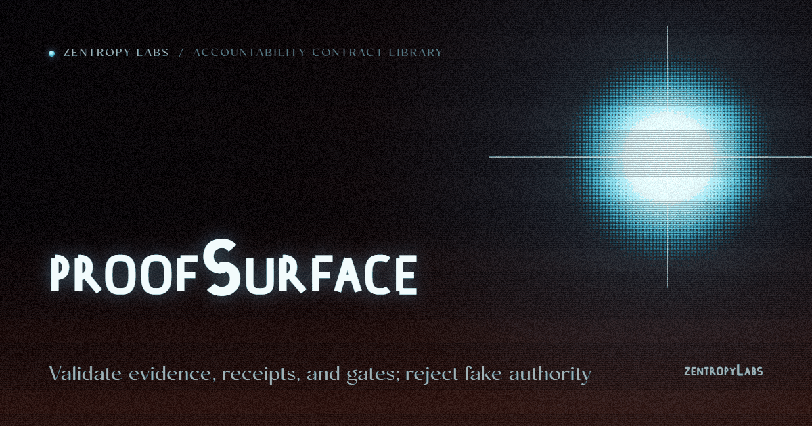

<p align="center"></p>

**One proof packet per agent action. Verdicts are derived from checks, never read from the packet.**


[](https://github.com/HarperZ9/proof-surface/actions/workflows/ci.yml)


Proof Surface is a stdlib-only Python library of contract validators for AI workflow records: evidence packets, work receipts, pre-execution gates, claim ledgers, delegation chains, and evaluation contracts. On top sits a family of eleven domain proof-packet wedges that take evidence a tool already produces (an agent trace, a color measurement, a benchmark attempt, a solver run, a scientific claim) and turn it into a validated, re-derivable packet with a `MATCH` / `DRIFT` / `UNVERIFIABLE` verdict, all reachable through one CLI seam: `telos-proof <domain>`. Every packet can be re-checked by anyone, without trusting the producer.

## Highlights

- **Eleven domain wedges, one CLI.** `telos-proof agent-action`, `visual-measurement`, `research-claim`, `model-eval`, `optimization-workflow`, `rollout-receipt`, `eval-attempt`, `ai4science`, `conservation`, `control-certificate`, `competition-attempt`. Same mental model everywhere: evidence in, validated packet plus reviewer report out.
- **Every packet is re-derivable.** Each CLI run writes `packet.json`, a Markdown `report.md`, a content-addressed `bundle.json`, and crucible `thesis` / `measurements` / `assessment` files so an independent checker can recompute the verdict from the same evidence.
- **Honesty gates per domain.** Each wedge names the specific way its claim could be inflated (a benchmark that saw the answer, a read-only tool claiming a hardware calibration, an invariant check that cannot fail) and rejects the packet when that inflation is present.
- **Nine base contracts to validate evidence packets, receipts, gates, and ledgers.** Every validator returns `list[Issue]` with a precise JSONPath-style location; an empty list means valid. Decision helpers (`evaluate_gate`, `evaluate`, `verify_delegation`, `check_action`) return closed-lattice results, default-deny and fail-closed.
- **Adapters for the stack you already run.** `proof_surface.trace_adapters` normalizes OpenTelemetry and LangSmith / Langfuse traces, and imports evidence from MLflow, Weights & Biases, Braintrust, Arize Phoenix, promptfoo, Helicone, DVC, and SLSA / in-toto, declaring via `NON_INFERABLE` what each export cannot supply.
- **Zero runtime dependencies.** Pure stdlib. JSON Schemas in `schemas/`, valid and invalid conformance vectors in `conformance/`, runnable examples in `examples/`.

## Try it

Install from a checkout and run the suite (the `test` extra pulls in pytest and jsonschema):

```bash
python -m pip install -e ".[test]"
python -m pytest
```

Then build a real proof packet from a shipped example:

```bash
telos-proof visual-measurement \
  --input examples/visual_measurement/measurement.json \
  --claim "sRGB coverage measured on a read-only capture" \
  --scope "software capture only, no hardware probe" \
  --out ./demo-out
```

This prints a Markdown report starting with `**Verdict: MATCH**` and writes six artifacts to `./demo-out`: `packet.json`, `report.md`, `bundle.json`, `crucible-thesis.json`, `crucible-measurements.json`, `crucible-assessment.json`. `telos-proof --help` lists all eleven domains; `python -m proof_surface <domain>` is the equivalent module form, and each wedge also installs a standalone script (`proof-surface-agent-action`, `proof-surface-model-eval`, and so on).

For a tour of the Python API, run the end-to-end demo:

```bash
python examples/demo.py
```

## Why it matters

AI workflow records are only useful if another tool can check them. A log says what a producer chose to write down; a proof packet carries the evidence, the claim, the scope boundary, and a verdict that a checker re-derives from the evidence itself. Proof Surface is the validator layer that makes those records portable: it rejects malformed or authority-shaped content, confines verdicts to closed lattices, and never emits `TRUSTED` / `APPROVED` / `AUTHORIZED`. It validates records; it does not grant authority, execute actions, or store private payloads.

## Worked example

`check_action` verifies a specific action against an authorization receipt. It is default-deny: a structurally invalid receipt, a revoked grant, an expired window, or an out-of-scope action all deny.

```python
from datetime import datetime, timezone
from proof_surface import check_action, validate_authorization_receipt

receipt = {
    "authorization_version": "0.1",
    "receipt_id": "ar-demo",
    "kind": "authorization-grant",
    "principal": {"id": "user:alice@example.com", "role": "project-owner"},
    "agent": {"id": "agent:planner"},
    "intent": "Read repository files.",
    "scope": {
        "allowed_actions": ["read_file"],
        "allowed_targets": ["repo:proof-surface"],
    },
    "granted_at": "2026-06-17T00:00:00Z",
    "expires_at": "2026-06-19T00:00:00Z",
    "revoked": False,
}

now = datetime(2026, 6, 18, tzinfo=timezone.utc)
print(validate_authorization_receipt(receipt))                      # []
print(check_action(receipt, "read_file", "repo:proof-surface", now=now))    # None (allowed)
print(check_action(receipt, "delete_file", "repo:proof-surface", now=now))
# Issue(path='$.scope.allowed_actions',
#       message="action denied: 'delete_file' not in allowed_actions")
```

## The base contracts

| Contract | Validator | One line |
| --- | --- | --- |
| proof-surface packet (`v0.1`) | `validate_packet` | Neutral evidence/index packet a proof-index consumes. |
| work-record receipt (`v0.1`) | `validate_work_record` | Outward-flowing record of agent work; `additionalProperties: false` at every level, never read back as model state. |
| authorization receipt (`v0.1`) | `validate_authorization_receipt`, `check_action` | Explicit, least-privilege, expiring, revocable grant from a human principal. Verifier input only. |
| authorization receipt (`v0.2`) | `validate_authorization_receipt_v2`, `check_action_v2` | Exactly scoped inner receipt with agent, action, target, nonce, time window, revocation flag, and action budget. Signature trust and atomic consumption stay outside this library. |
| witness receipt | `validate_witness_receipt` | Consumer-side mirror of EMET's witness-receipt shape and closed verdict lattice. |
| pre-execution gate (`v0.1`) | `evaluate_gate`, `validate_gate_request` | Default-deny, fail-closed, advisory: allow / deny / needs-human with per-dimension checks. Any unconfirmable dimension escalates to needs-human. |
| evaluation contract (`v0.1`) | `validate_evaluation_contract`, `evaluate` | Eval as a deploy gate: deploy / block / needs-human, uncertainty-aware (a measured value whose interval straddles its threshold never silently passes). |
| claim ledger (`v0.1`) | `validate_claim_ledger`, `confidence_gate`, `find_conflicts`, `trace_dependents` | Traceable multi-agent memory: source-provided confidence, declared conflicts, cycle-safe contamination tracing. Reports provenance; does not adjudicate truth. |
| delegation chain (`v0.1`) | `validate_delegation_chain`, `verify_delegation`, `compute_binding`, `compute_chain_binding` | Authority rooted in a real human, monotonic scope attenuation per hop, SHA-256 hash-chained with a whole-chain binding. Verdicts: `VALID` / `DENIED` / `UNVERIFIABLE`. |
| organ receipt bundle (`v0.1`) | `validate_organ_receipt_bundle` | Interchange spine tying sibling receipts together by nonzero digest and reference, including TADR classification and control receipts; closed `receipt_kind` vocabulary, no embedded payloads. |

Integrity caveat, stated up front: the delegation hash-chain is keyless, so it gives self-consistent integrity, not tamper-evidence against an adversary who rewrites the document and recomputes every binding. Real anti-forgery needs an external anchor: pin `chain_binding` out-of-band or verify asymmetric signatures per hop. Demanding signature assurance with no verifier returns `UNVERIFIABLE`, never a fabricated `VALID`.

## The proof-packet wedges

Each wedge is a builder, a validator, a reviewer-facing report, and a CLI, sharing one verdict rule (`MATCH` / `DRIFT` / `UNVERIFIABLE`), a required decision summary, a non-promotion boundary, and a content-addressed bundle.

| Wedge | Turns this into a packet | Load-bearing honesty gate |
| --- | --- | --- |
| `agent-action` | an agent trace | admission / side-effects / evidence refs / typed failures / compute leases |
| `visual-measurement` | a read-only color / display measurement | no physical-calibration claim without hardware and mutation evidence |
| `research-claim` | a math / formal proof attempt | a PASSED kernel replay must disclose axioms, toolchain, source; never `PROMOTED_LAW` from one packet |
| `model-eval` | a model + eval set + directional metrics | default-deny promotion: promote only on overall `MATCH` |
| `optimization-workflow` | a solver run vs an exact baseline | a non-executed branch claims no coverage; a surrogate may not self-certify feasibility |
| `rollout-receipt` | an RL / post-training run | reward, verifier, admission, promotion stay separate |
| `eval-attempt` | a single benchmark attempt | `correct` with ground-truth access is contamination, not a pass |
| `ai4science` | a claim-to-experiment run | no unmeasured discovery claims; independent reproduction required |
| `conservation` | a transformation + declared invariant | the check must carry a negative fixture that provably breaks the invariant |
| `control-certificate` | a stability / feasibility claim | hardware validity is never claimable from simulation-only evidence |
| `competition-attempt` | a competition / judge attempt | source-pinned judge repo; verdicts cite only certificate layers that executed |

Optional disclosure fields ride the same spine and are held honest when present: `declared_branches[]` (a fenced branch claims no verdict and is not citable support), `witness_tier` (the promotion rung may not exceed the strongest verifier tier that executed), `evidence_classes[]` (single-modality evidence caps at the hypothesis rung), and `replication` (a generalization claim needs two or more independent `MATCH` instances). Omit them and a packet validates unchanged.

## Status

- Version 0.2.0, alpha. Contracts are versioned `v0.1` and may still change shape.
- Runtime: Python 3.10 or newer per package metadata; CI runs the suite on 3.11 and 3.12. Stdlib-only core, no runtime dependencies.
- The pytest suite plus the conformance vectors under `conformance/<contract>/v0.1/` are the verification surface for the current contracts.
- Boundary: Proof Surface validates records. It does not grant authority, execute actions, or store private payloads. EMET stays an independent peer, not a dependency; the witness-receipt validator mirrors its schema so other tools can validate EMET receipts without importing EMET.

## Documentation

- **[docs/INTRODUCTION.md](docs/INTRODUCTION.md)**: what it is, core concepts, and a first-ten-minutes walkthrough.
- **[USAGE.md](USAGE.md)**: the full call surface with worked examples and expected output.
- **[CHANGELOG.md](CHANGELOG.md)**: current delivery status.
- `examples/` for runnable demos, `schemas/` for JSON Schemas, `conformance/` for valid and invalid fixtures.
- Peer repos and the wider toolkit: [harperz9.github.io](https://harperz9.github.io).

[](https://harperz9.github.io)

A note on the through-line: a proof packet is only worth more than a log if it can be wrong in a way a checker can catch. Everything in this repo exists to keep that property.

## For developers

Keep the public README, package metadata, and examples aligned with current behavior. Before opening a PR or pushing a release, run the local package verification path:

```bash
python -m pip install -e ".[test]"
python -m pytest
```

See [AGENTS.md](AGENTS.md) for the repo-specific operating boundary. Brand assets live under `docs/brand/` (hero: `docs/brand/proof-surface-hero.png`).

## License

MIT.

---
**Zain Dana Harper**, small tools with explicit edges.
[Portfolio](https://harperz9.github.io) · [HarperZ9](https://github.com/HarperZ9)
<sub>Built with Claude Code; reviewed, tested, and owned by me.</sub>

## What this believes

This tool is one lane of a family that holds a single belief steady across
every surface: knowledge open to anyone who can attain the means; acceptance
decided by external checks, never reputation; every result re-runnable;
honest nulls first-class; ownership earned by comprehension; learning woven
into the work. The full text lives in [CREDO.md](CREDO.md).
The long form of this belief: [The Unbundling](https://github.com/HarperZ9/flywheel/blob/fix/release-model-identity/docs/essays/2026-07-13-the-unbundling.md).

---

**[Zentropy Labs](https://github.com/ZentropyLabs-ai)** · order out of entropy. An independent lab building evidence-first tools that leave a re-checkable artifact behind. Built by Zain Dana Harper in Seattle. The full workbench is at [Project Telos](https://harperz9.github.io).


---

## The Zentropy Labs ecosystem

This tool is one part of a family that holds a single belief steady across
every surface: knowledge open to anyone who can attain the means; acceptance
decided by external checks, never reputation; every result re-runnable;
honest nulls first-class; ownership earned by comprehension; learning woven
into the work.

- **[Workspace canon](https://github.com/HarperZ9/workspace)**: AGENTS.md, CREDO.md, MISSION.md, ECOSYSTEM.md
- **[Flywheel](https://github.com/HarperZ9/flywheel)**: the one platform (receipts, governance, infra controls, learning loop)
- **[Getting Started](https://github.com/HarperZ9/flywheel/blob/main/GETTING-STARTED.md)**: your first thirty minutes

**[Zentropy Labs](https://github.com/ZentropyLabs-ai)** - order out of entropy. Built by Zain Dana Harper in Seattle.
